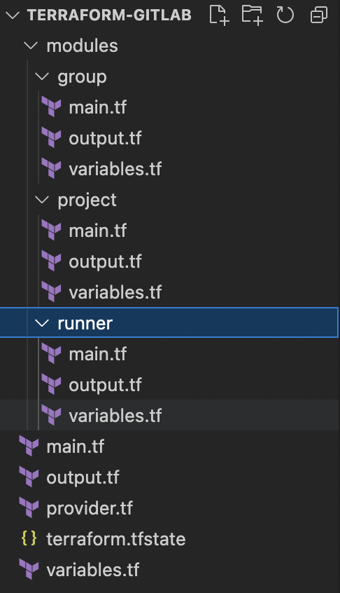

<h1 align="center">Terraform with Pagerduty</h1>

## Description 
In this case, we will told about how to create `PagerDuty` service via `Terraform`.  
`PagerDuty` uses for automate, orchestrate, and accelerate responses across your digital infrastructure.
[Read more about Pagerduty](https://support.pagerduty.com) . 
[Read more about Terraform](https://www.terraform.io) . 

## Hierarchy of our folders  
