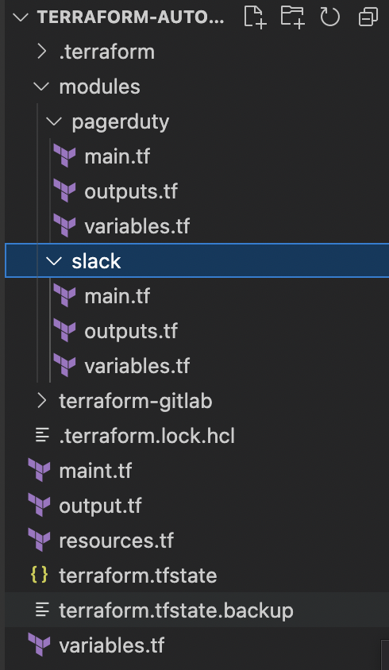

<h1 align="center">Terraform with Pagerduty</h1>


## Description 
In this case, we will told about how to create `PagerDuty` service via `Terraform`.  
`PagerDuty` uses for automate, orchestrate, and accelerate responses across your digital infrastructure.
[Read more about Pagerduty](https://support.pagerduty.com) . 
[Read more about Terraform](https://www.terraform.io) . 

## Hierarchy of our folders  
 .<br>
In this case we have `modulues` folder which include 2 modules `slack` and `pagerduty`.  
We will start from `pagerduty` module.  
```yaml
provider "pagerduty" {
    token = 123412441 # You can set environment variable locally with name PAGERDUTY_TOKEN=1234566788 for better security
}
```
On next step we will create `service directory` for project.  
```yaml
# Create service directory for project 
resource "pagerduty_service" "project_name" {
    name = "${var.project_name}"
    description = "Project ${var.project_name} status"
    escalation_policy = data.pagerduty_escalation_policy.main.id
    auto_resolve_timeout = 7200
    acknowledgement_timeout = "null"
}
```